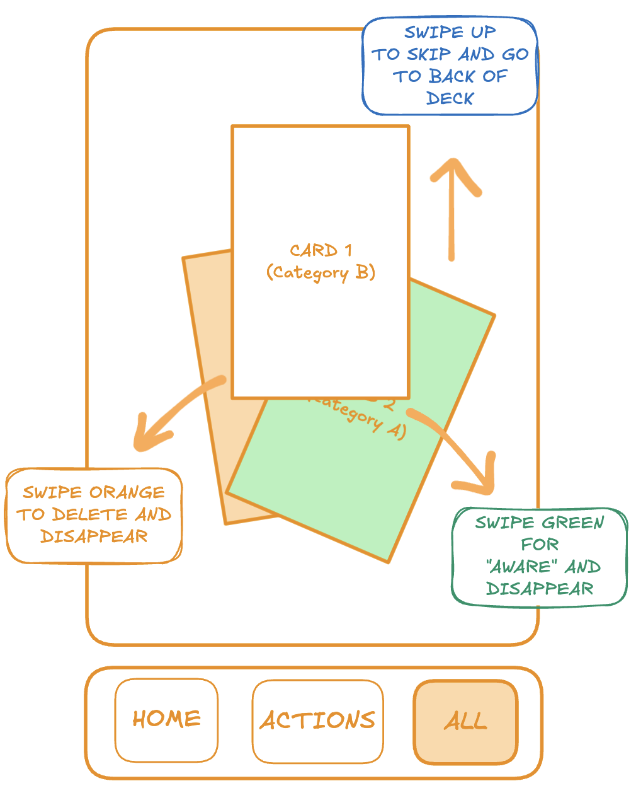

# Getting Started

Clairify helps you move through inbound messages faster so you can reach inbox zero multiple times a day. It summarizes what matters, lets you act with quick gestures, and keeps your email client labeled and organized in the background.

## 1. Install Clairify

Install the Clairify mobile app for iOS, have a Gmail or Outlook account, and be prepared to grant [read, write, and delete permissions](/oauth-scopes) so Clairify can summarize and organize messages on your behalf.

## 2. Connect Your Inbox

Open the app and sign in with Google or Microsoft. The account you use to sign in becomes your the email associated to your Clairify accountm, and is used for account notices. If Microsoft sign-in shows an Entra configuration message, follow the on-screen instructions to complete setup and try again.

## 3. See Messages as Cards

New items appear as swipeable cards. Each card shows a concise AI summary; tap to reveal the original message whenever you want full detail. This flow lets you absorb information quickly while keeping the source one tap away.

## 4. Triage with Swipes

{width="60%"}

1. **Swipe right — Mark as read.** Your email is marked read and a matching Clairify label is applied in your email client so organization stays in sync.  
2. **Swipe left — Discard/Trash.** Move low-value messages out of your way and keep focus on what matters.  
3. **Tap Important — Mark important.** Flag messages you need to revisit and surface them later.  
4. **Tap Archive — Archive.** File away items you’ve processed while keeping searchability.  
5. **Skip — Decide later.** Leave the card for another pass if you’re not ready to decide.

## Choose Your Summary Style

Pick a default style that fits your preference and the content you see most. Use **Narrative** for short correspondence, **Bullets** for quick scans of notifications, **Outline** for digests and long newsletters, and **Polished** for richer briefs with sections. If you want something ultra-short or specialized, create a custom summary prompt and pair it with the content types you care about.

## Automatic Classification (and Custom Classes)

Clairify recognizes common message types such as correspondence, newsletters, promotions, transactions, and social updates. If something should live in a different bucket, create a custom class and choose the summary style you want for it.

## Stay in Sync

Clairify listens for inbox changes from your provider and keeps states aligned. Real-time updates arrive via provider notifications. You can run **Force Sync** any time to compare recent mail, add anything new, and remove items you deleted outside Clairify. A weekly sync also runs automatically. If a token expires or an inbox is idle for more than seven days, Clairify pauses notifications to prevent retries; sign in again to resume, and the app will backfill recent mail.

## Add More Inboxes

After your primary inbox, connect additional Gmail or Outlook addresses to bring all your personal and work mail under one roof. Actions and summaries work the same way across every inbox you connect.

## Groups, Channels, and Briefings (Optional)

Email Groups let you automatically collect related messages using simple rules (for example, subjects containing “invoice” or senders like `alerts@…`). Combine groups into Channels to create curated streams you can keep for yourself or share with teammates. You can also enable Briefings to receive twice-daily digests of what you’ve missed at 08:00 and 20:00 UTC, and optionally use a custom briefing prompt.

## Settings You Control

Manage summary styles, classes, groups, channels, and connected inboxes. You can also bring your own API key if needed. Use **Log Out** to revoke tokens and unsubscribe from push notifications; on next sign-in, Clairify backfills recent messages. You can also **Delete Account** to permanently remove your data and sign out everywhere.

## Troubleshooting

If items don’t look right, run **Force Sync**, then reopen the app. If summaries feel off, switch styles or create a custom prompt. For Microsoft sign-in issues, complete the Entra configuration via the on-screen link and try again. If problems persist, sign out and back in to refresh tokens and resubscribe.

## You’re Ready

Connect your inbox, pick a summary style, and swipe through your first set of cards. In a few minutes you’ll have a cleaner mailbox—and the confidence that nothing important was missed.
