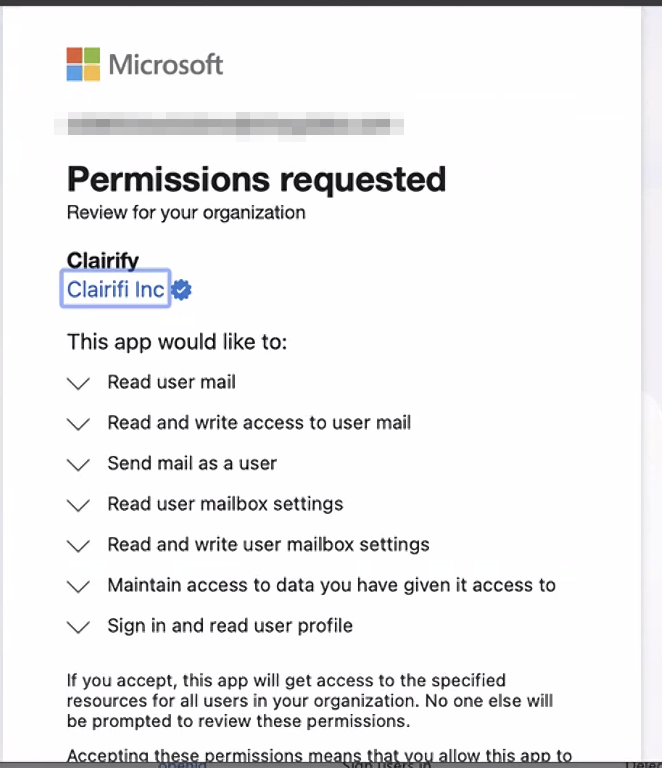

# OAuth Scopes - Outlook

!!! tip inline end

    While, Clairify requests Microsoft's `Mail.ReadWrite` permission, which does allow us to permanently delete messages, we still never delete your emails. Instead discarded messages simply are moved to a **`ClairifyTrash`** folder.

We request a small set of Microsoft Graph permissions to:

1. Sign you in and create your Clairify account,
1. Read your messages to summarize them,
1. Apply lightweight user-initiated changes to your mailbox, and
1. Send messages you compose — Replies, reply all, forwards, and new emails

Outlook and Microsoft 365 require an administrator to approve Clairify for an organization before anyone can sign in. See [Before You Can Login With Outlook](outlook-sso.md) for that one-time setup.

 

Table: Complete List of Requested Microsoft Graph Permissions {#graph-scopes}

| Purpose | Scope | What it allows | Example |
|--------|-------|----------------|---------|
| **Sign-in & session** |  |  |  |
| Sign-in & account association | <nobr>`openid` `email` `profile` `User.Read` | Verify identity, link the correct Microsoft account, and load basic profile details (name, avatar, email). | Sign into the app, show your name/avatar, tie your account to the right mailbox. |
| Keep you signed in | `offline_access` | Maintain access with refresh tokens so you don't re-authenticate constantly. | Shown as "Maintain access to data you have given it access to" on the consent screen. |
| **Mail** |  |  |  |
| Read mail for summarization | `Mail.ReadWrite` | Create, read, update, and delete messages in your mailbox. | Generate summaries for new messages and newsletters. |
| Apply user-initiated mailbox changes | `Mail.ReadWrite` | Toggle read/unread; create folders; move messages between folders; apply categories. | Swipe right to mark as read; discard to move a message into the `ClairifyTrash` folder. |
| Send mail on your action | `Mail.Send` | Send messages you compose — New emails, replies, reply all, and forwards. Sending is always initiated by you. | Reply, reply all, or forward a message from a card; compose a new email within Clairify. |
| Read mail | `Mail.Read` | View messages without modifying mailbox state. | Redundant when `Mail.ReadWrite` is granted. |
| **Mailbox settings** |  |  |  |
| Read & write mailbox settings | `MailboxSettings.ReadWrite` | Read and write your mailbox settings — Time zone, categories, and related configuration. | Read the mailbox configuration Clairify relies on to organize and display your mail. |
| Read mailbox settings | `MailboxSettings.Read` | Read mailbox configuration such as time zone and categories. | Redundant when `MailboxSettings.ReadWrite` is granted. |
    
## Permission Philosophy

- **Least privilege** — We request only the permissions needed for the features above.  is the single source of truth for scope purposes and examples.
- **User-initiated changes only** — Any mailbox modification or outbound message happens in response to your actions in the app, e.g., mark as read, categorize, move a message to the `ClairifyTrash` folder, or send a reply you composed. Clairify never sends on its own.
- **Content boundaries** — Only email messages and their attachments are accessed, and for no purpose other than to generate summaries and to send the messages you compose.

## Admin Consent Flow

Because Microsoft treats mailbox access as an organization-level decision, a **Global Administrator** grants consent once on behalf of the company:

1. An admin registers and approves Clairify in [Microsoft Entra](https://entra.microsoft.com).
2. The admin reviews the permissions listed in  and clicks **Accept**.
3. After that, non-admin users at the organization can sign in with Outlook normally.

The consent screen an administrator sees maps directly to the permissions in :

{width="55%"}

Full step-by-step instructions are in [Before You Can Login With Outlook](outlook-sso.md).

## Token Lifecycle & Revocation

Access tokens are short-lived; refresh tokens (`offline_access`) keep sessions active until access is revoked or you sign out. Either option immediately terminates our access to your mailbox and its change notifications.

To revoke access:

- **Individual**: [My Account](https://myaccount.microsoft.com) > Apps & devices, or [My Apps](https://myapps.microsoft.com), or
- **Global Administrator**: [Microsoft Entra](https://entra.microsoft.com) > Enterprise applications > **Clairify** > remove the app or revoke consent.

## Security & Access Transparency

- **Credentials & secrets** - OAuth tokens are encrypted at rest.
- **Access controls** - We enforce role-based, least-privilege access to production systems and customer data (emails, summaries, categories/metadata), cryptographic secrets/tokens, and operational tooling (databases, storage, logs, admin consoles).
- **Accountability** - All privileged access&mdash;including use of administrative tooling for technical support and debugging&mdash;is logged and auditable.

## Scope Change Policy

Any addition or elevation of permissions requires renewed admin consent. When Clairify adds a permission, an administrator must approve it before it can be used in production.

## Additional Resources

- [Microsoft Graph permissions reference](https://learn.microsoft.com/en-us/graph/permissions-reference)
- [Microsoft Graph mail API](https://learn.microsoft.com/en-us/graph/api/resources/mail-api-overview)
- [Outlook categories](https://learn.microsoft.com/en-us/graph/api/resources/outlookcategory)
- [Grant tenant-wide admin consent](https://learn.microsoft.com/en-us/entra/identity/enterprise-apps/grant-admin-consent)
