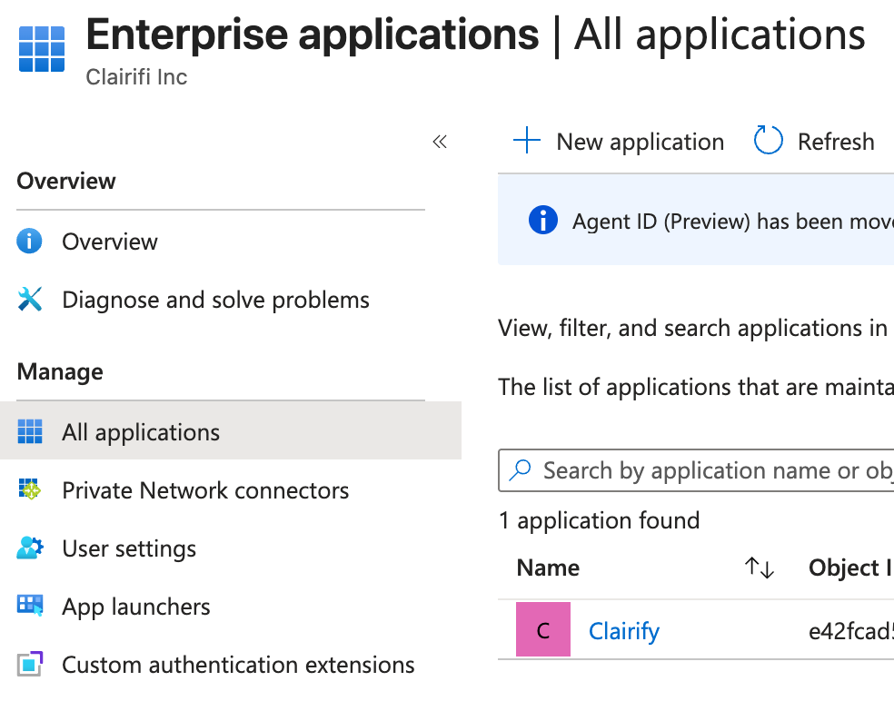
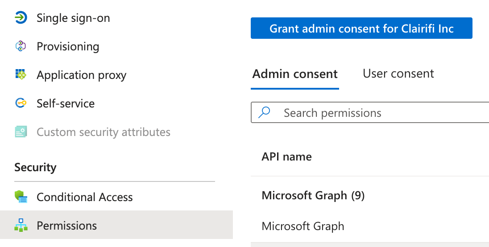
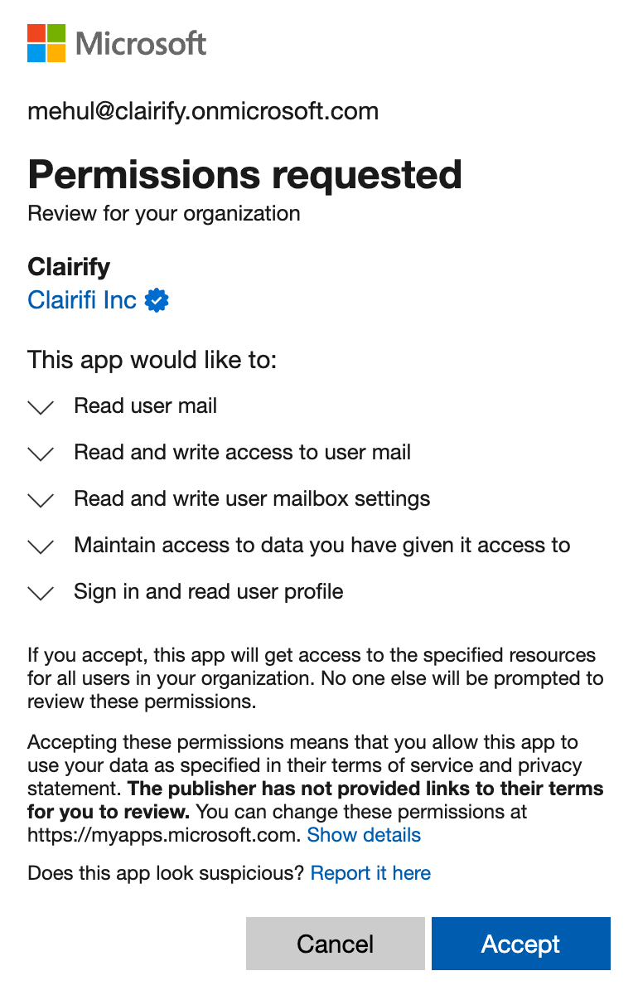
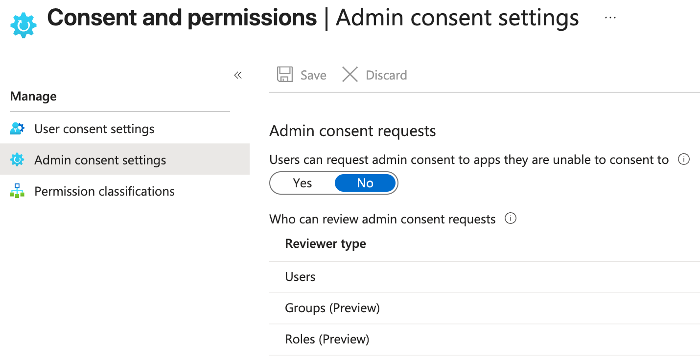

# Before You Can Login With Outlook

Microsoft designed Outlook and Microsoft 365 for large companies with very strict security rules. Because of that, Microsoft doesn’t let new apps automatically connect to work email the way Gmail does. Before anyone at a company can sign in to Clairify using Outlook, someone who manages the company’s Microsoft account needs to permit Clairify. This is Microsoft’s way of making sure no app can quietly access company email without approval. This setup only needs to be done one time. After that, everyone else at the company can log in to Clairify normally using Outlook.

!!! tip "Microsoft Documentation "

    These instructions are simplified based on the app registration procedure from the Microsoft documentation [here](https://learn.microsoft.com/en-us/entra/identity/enterprise-apps/grant-admin-consent?pivots=portal#grant-tenant-wide-admin-consent-in-enterprise-apps-pane).

## Part 1: Register Clairify In Microsoft Entra

Microsoft Entra is Microsoft’s control panel for companies, where they manage who can sign in, what apps are allowed, and how work email accounts are protected. In this step, we’re telling Microsoft that Clairify is a trusted app so people at your company are allowed to sign in with Outlook.

### Step 1: Login with an Admin Email

1. Install the Clairify app on an iPhone.
2. Open Clairify.
3. Choose **Outlook** as the login option.
4. When prompted, select the an Outlook account with the **Global Administrator** role.
    * The account does **not** need to have a mailbox.
    * The login may fail — that is okay.

### Step 2: Open Microsoft Entra Admin Center

1. Open an **incognito/private** browser.
2. Go to [Microsoft Entra](https://entra.microsoft.com).
3. Sign in using the **Global Administrator** account.

### Step 3: Find the Clairify App

1. In the left navigation, click **Enterprise apps**.
2. In the **All applications** list, find **Clairify**.
   - The icon is a simple **“C”** with a pink background.
3. Click **Clairify**.

{width="60%"}

### Step 4: Grant Required Permissions

1. On the Clairify overview screen, click **Permissions**.
2. Ensure the top selector is set to **Admin consent**.
3. You should see a list of Microsoft Graph permissions.
4. Click **Grant admin consent for Clairifi Inc**.
5. When prompted, select the **Global Administrator** account.

{width="60%"}

6. On the permissions screen, click **Accept**.
    * Microsoft might show fewer permissions than listed in the table of Microsoft Graph permissions — this is normal.

{width="30%"}

7. You can exit Entra now.

!!! success "Checkpoint"

    At this point, Clairify is authorized for your organization.

## Part 2: Login as a Non-admin User

1. Login to Clairify using your personal **non-admin** account.
2. You should now be able to complete the login.

!!! success "Checkpoint"

    That's it! You're done.

## Part 3 (Optional): Require Approval To Login To Clairify

This part is optional. You only need it if you want to be notified when someone at your company tries to connect Clairify to their work email. When another person at your company opens Clairify and tries to sign in with Outlook, Microsoft may pause the sign-in and show an “Approval required” message.

1. The user will be prompted to submit a short justification, e.g., “I need this for Clairify email summaries”.
2. Microsoft then sends an email to the admin or designated reviewer letting them know there’s a new request.  
3. They then open Microsoft Entra to review the request.
4. The user will get an email saying whether the request was approved or denied.
5. If approved, the user can return to Clairify and try signing in again.

!!! tip "Microsoft Documentation "

    These instructions are simplified based on the admin consent workflow configuration procedure from the Microsoft documentation [here](https://learn.microsoft.com/en-us/entra/identity/enterprise-apps/admin-consent-workflow-overview).

If you want to enable the workflow described above:

1. In the left navigation, click **Enterprise apps**.
2. Click **Consent and permissions**.
3. Click **Admin consent settings**.
4. Set all three options to **Yes**.
5. Under **Reviewer type → Users**, click the **Reviewers** link.
6. Select the email address you want receive approval emails.
7. Click **Select** to save.

{width="60%"}

!!! success "Checkpoint"

    Your organization is fully configured for Outlook Single Sign-On (SSO) with Clairify.

